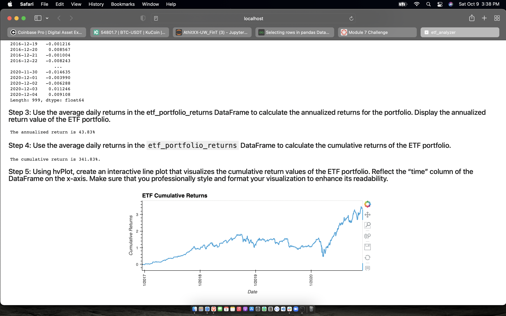

# AthitXX-UW_FinTech_Challenge_7

---

## Description
This notebook contains an ETF analysis program written in python and SQL deployed to a web application using Voila.

There are 4 sections to the ETF analysis program, as listed below

Analyze a single asset in the ETF

Optimize data access with Advanced SQL queries

Analyze the ETF portfolio

Deploy the notebook as a web application

---

## Technologies

This notebook utilizes the following technologies:

Pandas
sqlalchemy
hvplot
voila

---

## Installation

conda install pandas
conda install -c pyviz hvplot
pip install SQLAlchemy
conda install -c conda-forge voila
  
---

## Contributors

Athit Padmasuta - padmasuta78@gmail.com

---

## License

GNU Public License V3.0